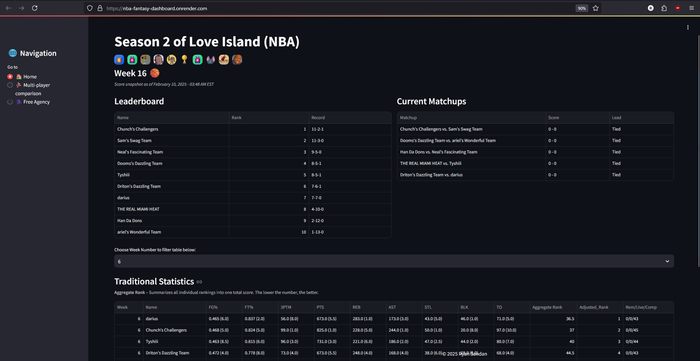

# 🏀 NBA Fantasy Dashboard

[Click here to check it out](https://nba-fantasy-dashboard.onrender.com/)


⚠️ Warning: Free Tier Instance Downtime

This project is hosted on Render.com, using their free tier instance. One important limitation of the free tier is automatic spin-down due to inactivity.
- If there are no active requests for a period of time, the instance will stop running.
- When a new request is made after inactivity, Render will restart the instance, which can cause a delay of ~50+ seconds before the app is available again.
- So if no one has entered the site in a while, the first person who does will experience a blank webpage basically... but give it a min or two and refresh the page and you'll see it 👍🏽

---
## Introduction
In my first run around with playing fantasy hoops, I wanted to explore the capabilities of Yahoo's Fantasy API and see what insightful extractions I can make out of it — analyzing matchup data (head-to-head), free agency transaction data, looking for patterns of players added/dropped at certain times, etc. This analysis initially started in a local `google colab` notebook, where I used `ngrok` python library as an initial mock up. However, each time I spun up the site, it'd be a new url. So now that I landed on something acceptable, I wanted to host it online so I could share it with my friends. Hosting this project on `render.com` made me learn a lot of things, with a lot of *debugging sessions*. `Google/StackOverflow/ChatGPT` were my main resources in finding solutions. 

## 🚀 What I learned:
- OAuth 2.0 (specifically OAuth initialization without requiring user input/login)
- Writing Environment Variables & Secret Files for Yahoo’s access tokens and refresh tokens (no more Enter Verifier: errors 🎉)
- Successful Deployment (via Render.com)
- Understanding Yahoo Fantasy API Structure for retrieving stats, standings, and player movements
- Hosting Web Apps on Render and working with authentication challenges
- [Yahoo Fantasy API documentation](https://yahoo-fantasy-api.readthedocs.io/en/latest/yahoo_fantasy_api.html)
- [Render.com Documentation](https://render.com/docs)

## 📊 Yahoo! Fantasy League Details
**League Name**: Season 2 of Love Island (NBA)
**League Details**: H2H 10T 9CAT
  - H2H - Head to head (Weekly matchup)
  - 10T - 10 Team
  - 9CAT - 9 Categories (FT%, FG%, 3PTM, PTS, TREB, AST, STL, BLK, TO)

    
### Below is a ChatGPT response to my prompt: "So all in all what did I learn after all my debugging sessions?" 
- ***I will include details on what I learned about Yahoo's Fantasy API in the near future***

# **Yahoo! NBA Fantasy Dashboard Deployment Guide**
### This is a **Yahoo NBA Fantasy API dashboard**, hosted on **Render.com**. This guide covers **key lessons learned** during development and deployment. ###

## **1️⃣ OAuth2 Authentication with Yahoo Fantasy API**

### **What I Learned**
- Yahoo Fantasy API uses **OAuth2**, which requires **client credentials** (client ID, client secret). So make sure you create a Yahoo Developer account.
- A **keypair.json** file is needed to store **access tokens** and **refresh tokens**.
- **Access tokens expire**, so we need to **refresh tokens automatically**.
- The `redirect_uri=oob` (out-of-band) **is deprecated**—we need to specify a valid redirect URI in Yahoo Developer settings.
- **Manually initializing OAuth2** in Python helps avoid interactive prompts:
  
  ```python
  sc = OAuth2(
      keypair["consumer_key"],
      keypair["consumer_secret"],
      access_token=keypair["access_token"],
      refresh_token=keypair["refresh_token"],
      token_time=keypair["token_time"],  
      token_type=keypair["token_type"]  
  )
  ```

- **Refreshing the token** automatically when expired:
  
  ```python
  if not sc.token_is_valid():
      sc.refresh_access_token()
  ```

---

## **2️⃣ Environment Variables & Secrets Management**

### **What I Learned**
- **Do not hardcode API keys** (use environment variables or secret files).
- In **Render.com**, store secrets in **Environment Variables** or `/etc/secrets/`.
- Access them in Python like this:
  
  ```python
  import os
  NGROK_AUTH_TOKEN = os.getenv("NGROK_AUTH_TOKEN")
  ```

- **Updating keypair.json** requires replacing the secret file manually.

---

## **3️⃣ Why We Removed Ngrok** 

### **What I Learned**
- **Ngrok is useful for local testing**, but it’s not needed for Render hosting.
- Free Ngrok accounts allow **only one active tunnel at a time**, which caused `ERR_NGROK_108`.
- Render **already provides a public URL**, so **Ngrok is unnecessary**.

### **Steps Taken**
✅ **Removed all Ngrok references** from the code.  
✅ **Used Render's default URL** instead of manually tunneling traffic.  
✅ **Updated the start command** for Render.

---

## **4️⃣ Deploying to Render.com**

### **What I Learned**
- Create a **`render.yaml`** file to define deployment settings.
- Store API keys in **Render's Environment Variables** or **Secret Files**.
- **Start Command for Streamlit apps**:
  
  ```bash
  streamlit run app.py --server.port $PORT --server.address 0.0.0.0
  ```
  
- **Debugging Render Logs** helps fix deployment issues.

---

## **5️⃣ Using Git Properly**

### **What I Learned**
- **Avoid pushing secrets to GitHub** (use `.gitignore`).
- Commands to remove sensitive files from GitHub history:
  
  ```bash
  git rm --cached keypair.json ngrok_token.txt
  echo "keypair.json" >> .gitignore
  echo "ngrok_token.txt" >> .gitignore
  git commit -m "Removed sensitive files from GitHub"
  git push origin main
  ```
  
- Keep **environment variables secure** instead of storing secrets in the repo.

---

## **Conclusion**

🔥 **Now the app is fully deployed on Render.com** and can be shared with others!  
💡 **Biggest lesson:** OAuth2, token handling, and proper deployment practices are crucial for real-world web applications.

---

### **Next Steps**
- ✅ **Share the Render URL** with friends.  
- ✅ **Monitor logs for any errors**.  
- ✅ **Add new features** (e.g., more data visualizations).  

---
