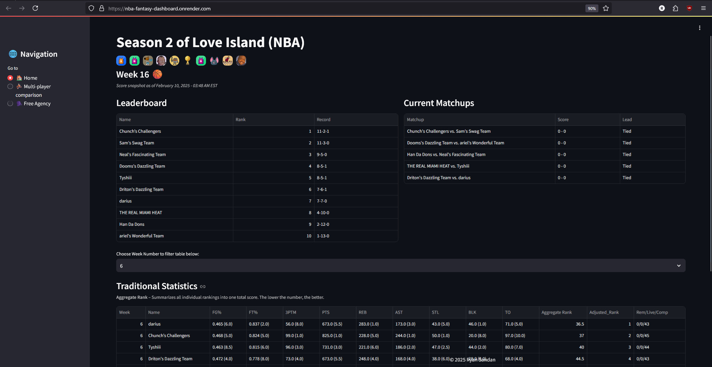

# 🏀 NBA Fantasy Dashboard

[Click here to check it out](https://nba-fantasy-dashboard.onrender.com/)

⚠️ Hosted on Render's free tier, so the app spins down when idle. If nobody has visited in a while, the first load takes ~50 seconds. Give it a minute and refresh.

---

## What this is

A Streamlit site for my friends' Yahoo Fantasy Basketball league (**Love Island (NBA)**, H2H, 10 teams, 9 categories: FG%, FT%, 3PTM, PTS, REB, AST, STL, BLK, TO).

Season 1 was a scoreboard: standings, this week's matchups, and a "sum of category ranks" table. For season 3 I rebuilt it as a decision tool with a real model underneath:

| Page | What it answers | Method |
|---|---|---|
| **This week** | Who's going to win each matchup, category by category? | Monte Carlo simulation of the rest of the week (banked stats + remaining games) |
| **Power rankings** | Who's actually good, and who's been lucky? | All-play records, schedule luck, model-based power rating, playoff odds |
| **Matchup lab** | Team A vs Team B in a neutral week? How good is the model? | Same simulator + a walk-forward backtest with calibration |
| **Player values** | Who helps a 9-cat team most, for my build? | Replacement-aware z-scores with punt support, early-season shrinkage |
| **Trade analyzer** | Should I take this deal? Would they? | z-score deltas weighted by each team's swing categories, roster-spot pricing |
| **Streaming board** | Who do I add today? | Value above replacement × games left, weighted by which categories are still in play this week |
| **Free agency** | Who works the wire and does it pay off? | Add/drop pairing, hold times, stream rate, timing heatmap, activity vs all-play |
| **Player comparison** | Side by side for 2 to 5 players | League-wide per-game lines, volume-weighted percentages |

Everything runs without credentials in **demo mode** on a synthetic league: `FANTASY_DEMO=1 streamlit run app.py`.

## Modeling notes

### 1. The matchup model (`fantasy/matchup_model.py`)
Each team-week is reduced to **per player-game rates** over 11 additive components (FGA, FG%, FTA, FT%, 3PTM, PTS, REB, AST, STL, BLK, TO). Working per game instead of per week separates roster quality from schedule volume, since Yahoo tells us each team's games remaining in advance.

- **Team means:** a recency-weighted average (6-week half-life) shrunk toward a prior worth 3 weeks of data. The prior is the team's **current roster projection** (rescaled to the league's observed per-started-game level), so week-1 predictions and post-trade teams are sensible.
- **Noise:** week-to-week residuals are pooled across the league into an 11×11 covariance, rescaled by games played, and regularized (30% shrinkage of off-diagonals). Categories are correlated: a high-volume week lifts PTS, 3PTM, FGA *and* TO together. Treating them as independent overstates sweeps.
- **Parameter uncertainty:** simulations add the posterior variance of each team's mean (`1 / (weeks of evidence + prior weeks)`), so early-season probabilities aren't overconfident. For season simulations that uncertainty is drawn once per simulated season, because a team's true strength doesn't re-roll every week.
- **Percentages are simulated correctly:** draw attempts and make rate, compute makes, then divide. Totals are rounded to integers and percentages to Yahoo's 3-decimal display precision, so category ties happen at realistic rates (they're common in BLK and STL).

**Backtest (Matchup lab):** walk-forward. For every completed week *w*, fit on weeks before *w* only and predict every category of every matchup before tipoff. It reports Brier score, log loss, Brier skill score vs a coin flip, an empirical "compare past weeks directly" baseline, and a reliability curve. On the synthetic league the model scores a category Brier skill score of roughly 0.28 versus about 0.09 for the empirical baseline, and the calibration curve tracks the diagonal. Real-league numbers show up on the page once five weeks are complete.

### 2. Player valuation (`fantasy/valuation.py`)
- **Replacement-aware pool:** z-scores are measured against the top `teams × roster spots` players, chosen iteratively, not against all ~550 NBA players (that inflates everyone).
- **Percentages use impact:** `(player% − pool%) × attempts`. A 60% shooter on 3 FGA barely moves a weekly FG%; a 52% shooter on 20 FGA moves it a lot.
- **Punting** removes a category from the total *and* from pool selection.
- **Early-season shrinkage:** each player's current line is blended with last season using `w = GP / (GP + 15)`, so a hot five-game start doesn't top the board. Before opening night this makes the page a draft board built on last season.
- **Availability-adjusted value** discounts players who miss games.

### 3. League analytics (`fantasy/power.py`, `fantasy/transactions.py`)
- **All-play:** every week, every team is scored against *all* opponents. The gap between actual and all-play win% is **schedule luck**.
- **Playoff odds:** 2,000 simulated seasons using the real remaining schedule and the league's scoring format (`head` = every category counts in the standings, `headone` = one result per matchup).
- **Trades:** category deltas are weighted by `0.25 + 0.75 × 4p(1−p)`, where *p* is the team's all-play win rate in that category. Swing categories matter most; locked or punted ones barely count. Uneven trades are priced at replacement level for the roster spot opened or lost. The analyzer shows both sides' view, so you can find deals that help both teams.
- **Wire activity:** each add is paired with the same team's next drop of that player. Hold time is censored for players still rostered, so medians aren't biased short.

## Fixes to the season-1 code

- Removed the hard-coded league key and `team_ids` dict. The league and team names are discovered at runtime, so the app survives Yahoo's new league key every season.
- Removed the hard-coded `season="2024-25"` and `"Week 22"`.
- The scoreboard parser now keeps `FGM/A` and `FTM/A`. The old one dropped them, which made correct percentage aggregation impossible.
- Player comparison averaged per-game FG% (so 1-for-1 counted the same as 10-for-25). It now uses total makes ÷ total attempts.
- OAuth tokens refresh into a writable temp copy. Render mounts `/etc/secrets` read-only, so in-place refreshes failed once the one-hour token expired.
- **Caching:** completed weeks are cached for the life of the process, the live week for 5 minutes, and NBA stats for 6 hours. Previously every page view re-fetched every week from Yahoo.
- Renamed the entry point from `streamlit.py` to `app.py`. A script named `streamlit.py` shadows the `streamlit` package on import.
- Built the "Free Agency" page, which was listed in the sidebar but never implemented.
- Removed the unused dependencies (`boto3`, `matplotlib`, `seaborn`).

## Project layout

```
app.py                     Streamlit UI (8 pages), caching layer
fantasy/
  categories.py            9-cat definitions, tie/NaN-aware category comparison
  yahoo_client.py          OAuth, league discovery, pure JSON parsers (scoreboard, transactions)
  nba_data.py              nba_api per-game stats, schedule, season blending, name matching
  matchup_model.py         team-strength model, Monte Carlo simulator, walk-forward backtest
  power.py                 all-play, luck, power ratings, playoff odds
  valuation.py             replacement-aware z-scores, punts
  trade.py                 trade evaluation, context weights, streaming board
  transactions.py          add/drop pairing, activity, timing
  charts.py                Plotly figures (dark theme, colorblind-checked palette)
  data_source.py           live vs. demo switch
  demo.py                  synthetic league generator (tests + demo mode)
tests/                     34 tests: parsing, math, model skill/calibration, every page renders
```

## Running it

```bash
pip install -r requirements-dev.txt
FANTASY_DEMO=1 streamlit run app.py        # no credentials needed
pytest -q                                  # 34 tests, ~15s
```

**Live mode** needs Yahoo OAuth credentials: create an app at developer.yahoo.com, complete the OAuth flow once locally with `yahoo_oauth`, and provide the resulting JSON (`consumer_key`, `consumer_secret`, `access_token`, `refresh_token`, `token_time`, `token_type`) via one of:

- `KEYPAIR_JSON` or `YAHOO_OAUTH_JSON` environment variable (raw JSON), or
- a secret file at `/etc/secrets/keypair.json` (Render) or `./keypair.json` (local, git-ignored).

Optional: `YAHOO_LEAGUE_ID` (or `YAHOO_LEAGUE_KEY`) to pin a league. Otherwise the newest NBA league on the account is used. If Yahoo can't be reached, the site falls back to the demo league and says why instead of crashing.

**Render:** `render.yaml` sets the start command to `streamlit run app.py --server.port $PORT --server.address 0.0.0.0`. If the service was created by hand, update the start command in the Render dashboard to match.

## Known limitations

- Per-game rates assume Yahoo's `completed_games` counts started player-games. Daily lineup decisions (benching, IL moves) aren't modeled beyond that.
- The backtest plugs in the games each team actually got. The schedule is known ahead of time, but late injuries aren't, so treat backtest skill as a slight upper bound.
- Yahoo's playoff tiebreakers aren't exposed in the API, so exact ties in the playoff simulation are broken at random.
- stats.nba.com rate-limits cloud IPs. Calls retry with backoff, and pages degrade gracefully if it's down.

## Season-1 notes (OAuth + deployment lessons)

<details>
<summary>What I learned getting the first version live</summary>

- Yahoo's API uses OAuth2. Tokens expire after an hour, so refresh them automatically (`sc.token_is_valid()` / `sc.refresh_access_token()`).
- `redirect_uri=oob` is deprecated. Set a real redirect URI in the Yahoo developer settings.
- Keep secrets out of Git (`.gitignore`, environment variables, Render secret files).
- ngrok is handy for local demos, but Render already provides a public URL.
- Render logs are the fastest way to debug deploys.
- [Yahoo Fantasy API docs](https://yahoo-fantasy-api.readthedocs.io/en/latest/yahoo_fantasy_api.html) · [Render docs](https://render.com/docs)
</details>
